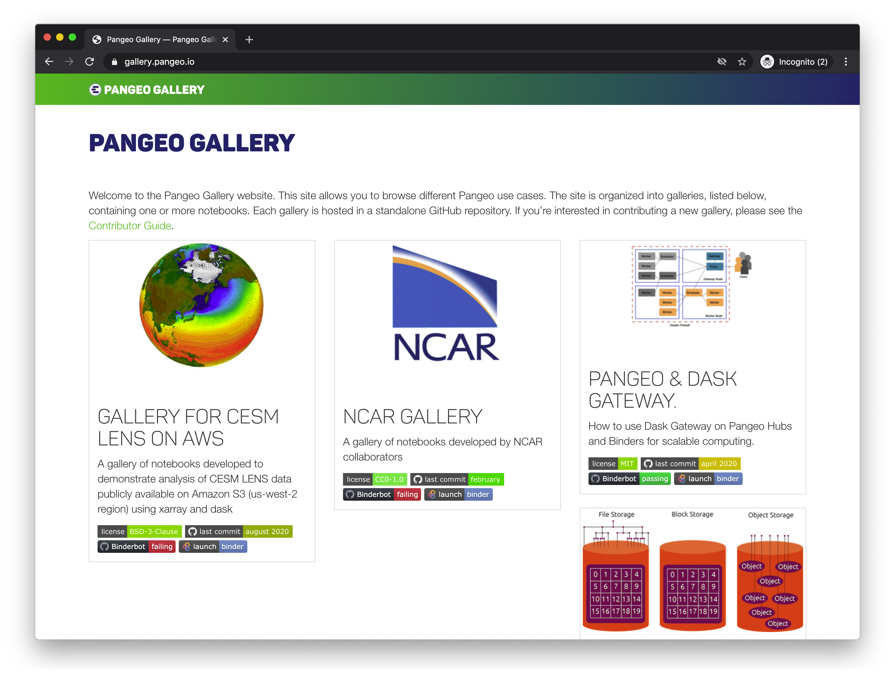

# MyBinder.org


The public and free [MyBinder.org](https://mybinder.org) service enable anyone to start and use a Jupyter environment that is automatically prepared with what's needed to run the content in a public git repository. As an example, you can click on [this mybinder.org link](https://mybinder.org/v2/gh/jupyterlab/jupyterlab-demo/master?urlpath=lab/tree/demo) to start and use a Jupyter environment with Python, C++, and R and some example notebooks from the [jupyterlab/jupyterlab-demo](https://github.com/jupyterlab/jupyterlab-demo) repository on GitHub.

## Terminology

As _Binder_ is often casually used to refer to multiple things, it's useful to distinguish that:
- _mybinder.org_ is a free and public service.
- _[BinderHub](https://binderhub.readthedocs.io/en/latest/)_ is the open source software used by mybinder.org.
- A BinderHub-ready git repository could be referred to as _a binder_.

## Creating a BinderHub-ready git repository

To make your notebooks accessible with mybinder.org, you have to make them public in a git repository and declare whats required for them to run properly.

### Recommended guides

While we provide some details below, we highly recommend the following more detailed external and programming language tailored guides:
- [Julia](https://github.com/alan-turing-institute/the-turing-way/blob/master/workshops/boost-research-reproducibility-binder/workshop-presentations/zero-to-binder-julia.md)
- [Python](https://github.com/alan-turing-institute/the-turing-way/blob/master/workshops/boost-research-reproducibility-binder/workshop-presentations/zero-to-binder-python.md)
- [R](https://github.com/alan-turing-institute/the-turing-way/blob/master/workshops/boost-research-reproducibility-binder/workshop-presentations/zero-to-binder-r.md)

### About specifying an environment

In order for mybinder.org to reproduce computational work in a notebook, it needs both the code itself and the code's dependencies declared, such as Python's `matplotlib` library.

To declare software dependencies for various programming languages, you can use standard configuration files. Some of the common configuration files recognized by all BinderHubs include:

- [environment.yml](https://mybinder.readthedocs.io/en/latest/using/config_files.html#environment-yml-install-a-conda-environment): a standard configuration file for installing packages from conda. 
- [requirements.txt](https://mybinder.readthedocs.io/en/latest/using/config_files.html#requirements-txt-install-a-python-environment): a standard file for installing Python packages using `pip install`
- [Project.toml](https://mybinder.readthedocs.io/en/latest/using/config_files.html#project-toml-install-a-julia-environment): the configuration file for installing a Julia environment
- [install.R](https://mybinder.readthedocs.io/en/latest/using/config_files.html#install-r-install-an-r-rstudio-environment): the configuration file for installing an R or RStudio environment

A complete listing of configuration files that can be used with Binder is available in the [documentation](https://mybinder.readthedocs.io/en/latest/using/config_files.html).

### Tips for reproducibility of results

- _Run your notebooks from start to finish_. By using `Kernel --> Restart --> Run All`, you can confirm that your notebooks were in and arrives to a state you are expecting (see the discussion on [managing state](managing-state.ipynb)).
- _Freeze your environment_. As software evolves, it is relevant for reproducibility to capture a snapshot in time of the current versions in your environment. To do so, you can for example use:
  - `pip freeze` to export to requirements.txt
  - `conda env export -n <env-name>` to export to `environment.yml`

### Example git repositories

An extensive listing of Binder-ready repositories for a range of programming languages is available in the [documentation](https://mybinder.readthedocs.io/en/latest/examples/sample_repos.html). For the geoscience community, a couple particularly-relevant examples include:

- [Python environment with a requirements.txt](https://github.com/binder-examples/requirements)
- [Conda environment with an environment.yml](https://github.com/binder-examples/conda) 
- [A Julia environment](https://github.com/binder-examples/demo-julia)
- [Julia + Python environments](https://github.com/binder-examples/julia-python)
- [An R environment](https://github.com/binder-examples/r)

## Sharing your notebooks on a public BinderHub

[mybinder.org](https://mybinder.org) and [binder.pangeo.io](https://binder.pangeo.io) provide public binders where you can create a link to an interactive session with your code. The image below shows the interface for [mybinder.org](https://mybinder.org). The Pangeo Binder interface is very similar and has additional functionality for launching a Dask-Kubernetes cluster for distributed computation. 


### Step 1: Specify Repository Location

If your repository is public on GitHub, as a Gist, on GitLab, Zenodo, Fighare or and of the locations in the first dropdown menu, the first step is to paste the URL into the first entry box. 

After you enter this, the URL in the "Copy the URL below and share your Binder with others" will begin to build. 

```https://mybinder.org/v2/gh/<username>/<repository>/HEAD```

### Step 2 (Optional): Specify a specific branch, tag or commit 

If there is a specific branch, tag or commit you would like built, you can enter that here. For example to build the `main` branch, you enter `main` and the URL will update to 

```https://mybinder.org/v2/gh/<username>/<repository>/main```

### Step 3 (Optional): Specify the path to a notebook or URL for a different interface 

If you would like a specific notebook to open when a user launches, you can specify that here. For example, if I want to point users to a summary notebook called `index.ipynb`, then on the right, I set the dropdown to "File", enter `index.ipynb` and the URL will update to 

```https://mybinder.org/v2/gh/<username>/<repository>/main?filepath=index.ipynb```

Alternatively, if you wanted to open in JupyterLab rather than the notebook (the current default), you can change the dropdown on the right to "URL" and enter `lab`. The URL will then update to 

```https://mybinder.org/v2/gh/<username>/<repository>/main?urlpath=lab```

Note that if you wanted to specify both a filepath and a urlpath, you can customize the link yourself

```https://mybinder.org/v2/gh/<username>/<repository>/main?urlpath=lab?filepath=index.ipynb```

### Step 4: Copy & Share

You can copy the constructed URL or there is also a badge that you can put in your repository README to show that your code can be run on Binder! 

## What happens when Binder builds your repository?

1. Binder fetches your repository from GitHub or wherever you specified its source location. 

2. [repo2docker](https://repo2docker.readthedocs.io) looks at your repository for the specified environment and builds a docker container from your repository 
    
    
3. Binder launches that Docker image in the Cloud

4. You are connected to that interactive session in your web-browser. 

## Some Geoscience Binders

We recommend taking a look at the [Pangeo Gallery](https://gallery.pangeo.io) for examples.


