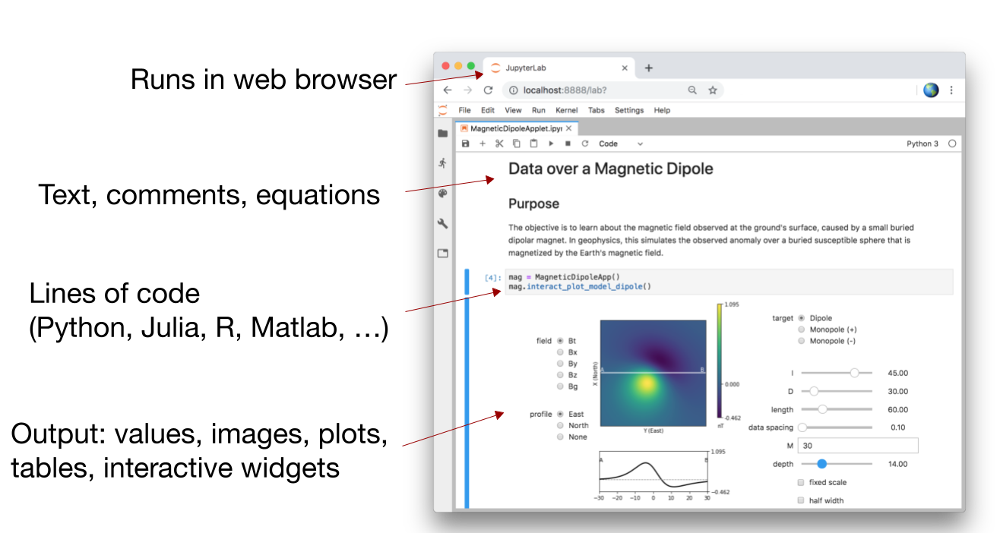
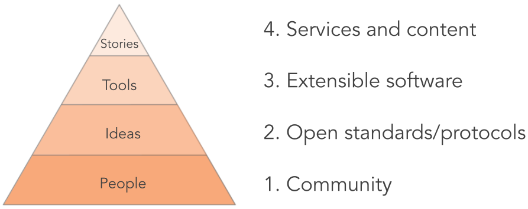

# A tour of Jupyter

## Jupyter Notebook - a web application for interactive computing.

The notebook lets you combine narrative text, equations, and figures with code and rich outputs in an interactive computing environment. It can be run on your local machine, an remote server at a High Performance computing facility or on the cloud. 

## Beyond the notebook - the broader Jupyter ecosystem

Notebooks are a core part of Jupyter, but the ecosystem of Jupyter tools for interactive computing is much broader. 

**JupyterLab** is the next generation interface for Jupyter. It includes notebooks, but also the ability to open a terminal, edit and run markdown files with computational content, and view a range of data types. It is extensible so new plugins can be added to extend its functionality. 

**JupyterHub** is a multi-user version of Jupyter. It allows Jupyter to be run on a shared computational infrastructure. For example on the Cloud or a High Performance Computing (HPC) Facility. 

Two popular projects for deploying JupyterHubs are 
- [The Littlest JupyterHub](https://tljh.jupyter.org/en/latest/) for a small number (0-100) of users on a single server
- [Zero to JupyterHub with Kubernetes](https://zero-to-jupyterhub.readthedocs.io/en/stable/) for deploying larger JupyterHubs on the cloud. 

**JupyterBook** lets you take a collection of notebooks and markdown files and turn it into a web-based textbook with JupyterBook. That is how we created this resource! Here are a few examples from the geoscience community
- [The Climate Laboratory](https://brian-rose.github.io/ClimateLaboratoryBook/home.html)
- [An Introduction to Earth and Environmental Data Science](https://earth-env-data-science.github.io/intro)

If you have created a book that you would like to share, please feel free to [suggest a change in the source repository](https://github.com/pangeo-data/jupyter-earth)

**Binder** lets you take a repository of notebooks with a specification of the software dependencies and share it so that others can run your code. There is an example deployment at [mybinder.org](https://mybinder.org/). 

## Kernels and protocols - a bit of architecture 

In addition to software, the Jupyter project also defines standards and protocols for interactive computing. By defining a protocol for interactive computing, a kernel can be defined for different programming languages. To date, there are over [100 different kernels](https://github.com/jupyter/jupyter/wiki/Jupyter-kernels) for running code interactively with Jupyter. 

## Community

Jupyter is more than the lines of code that the software contains. Jupyter is a community driven project with stakeholders and contributors from academia, industry and non-profit sectors. It is fiscally sponsored by [NumFOCUS](https://numfocus.org/project/project-jupyter). 

A few connection points with the community include: 
- the [blog](https://blog.jupyter.org/)
- the [discourse forum](https://discourse.jupyter.org/)
- and [twitter](https://twitter.com/projectjupyter)

### Connected communities 

[**Pangeo**](http://pangeo.io/) is a community platform for Big Data Geoscience. 

> Pangeo is first and foremost a community promoting open, reproducible, and scalable science. This community provides documentation, develops and maintains software, and deploys computing infrastructure to make scientific research and programming easier. The Pangeo software ecosystem involves open source tools such as xarray, iris, dask, jupyter, and many other packages. -- [What is Pangeo?](https://pangeo.io/#what-is-pangeo)

[**2i2c**](https://2i2c.org/) is the international interactive computing collaboration. 

> 2i2c is a mission-driven non-profit that develops, deploys, customizes, and manages open source tools for interactive computing in research and education. -- [2i2c](https://2i2c.org/)